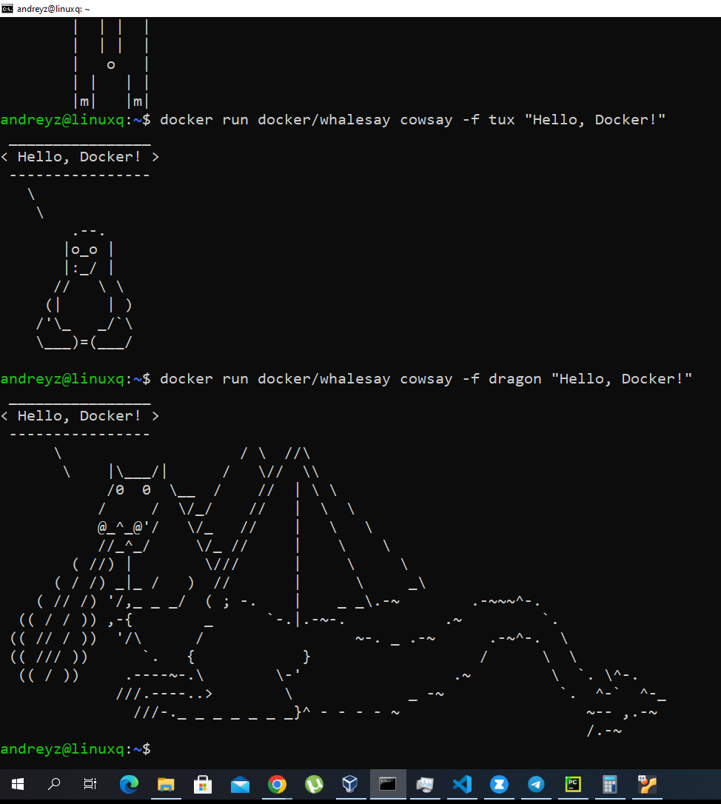
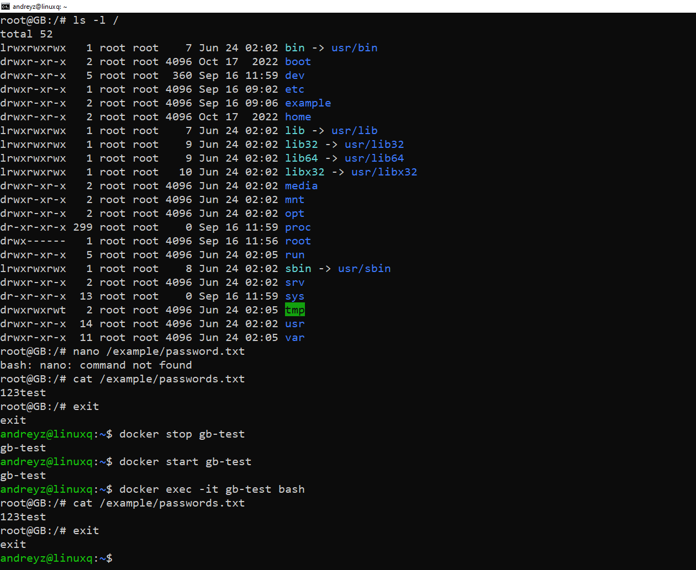
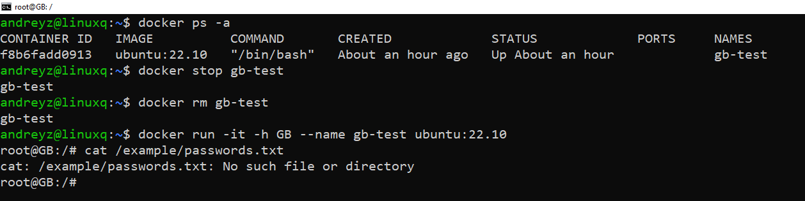
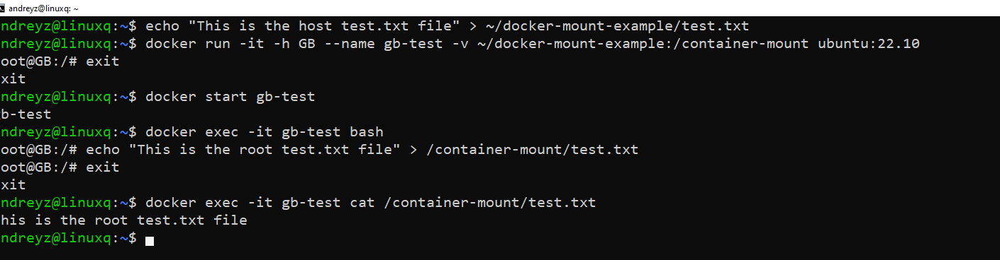

# Урок 3. Введение в Docker
## Устанавливаем Докер

Docker работает.
## Хранение данных в контейнерах Docker: Руководство с пояснениями
1. Для начала давайте запустим контейнер из образа Ubuntu и войдем в него:
``docker run -it -h GB --name gb-test ubuntu:22.10``
2. Посмотрим содержимое корневой директории:
``ls -l /``
3.Создадим новую директорию в корне:
``mkdir /example``
4. Создадим файл "passwords.txt" и добавим в него какие-либо данные (представим, что это данные сайта или базы данных). Но что делать, если у нас нет редактора? Продолжим.
``touch /example/passwords.txt``
``echo "123test" >> /example/passwords.txt``

Мы создали директорию и файл внутри контейнера Ubuntu.

5. Давайте попробуем остановить контейнер и затем запустить его снова. Сохранятся ли наши данные?
``docker stop gb-test``
``docker start gb-test``
``docker exec -it gb-test bash``
``cat /example/passwords.txt``

Наши данные сохранятся, так как мы не пересоздавали контейнер.

6. Удалим контейнер и создадим его заново, используя те же команды:
``docker stop gb-test``
``docker rm gb-test``
``docker run -it -h GB --name gb-test ubuntu:22.10``
`cat /example/passwords.txt`

В этот раз наши данные будут утеряны, так как контейнер был удален.

7. Создайте папку, которую мы будем готовы смонтировать в контейнер:
``mkdir ~/docker-mount-example``
В этой папке создайте файл test.txt и наполните его данными:

``echo "This is the host test.txt file" > ~/docker-mount-example/test.txt``
В домашней директории создайте файл test.txt, который также понадобится для монтирования в контейнер, но с другим содержимым:
``echo "This is the root test.txt file" > ~/test.txt``
Создайте контейнер из образа ubuntu:22.10 и задайте ему имя и hostname:
``docker run -it -h GB --name gb-test ubuntu:22.10``
Смонтируйте ранее созданную папку с хоста в контейнер:
``docker run -it -h GB --name gb-test -v ~/docker-mount-example:/container-mount ubuntu:22.10``
Смонтируйте созданный ранее текстовый файл из домашней директории внутрь смонтированной папки в контейнере:
``docker run -it -h GB --name gb-test -v ~/docker-mount-example:/container-mount -v ~/test.txt:/container-mount/test.txt ubuntu:22.10``
Посмотрите содержимое текстового файла в контейнере:
``cat /container-mount/test.txt``

Мы создали контейнер и монтировали папку docker-mount-example внутрь контейнера. Затем мы монтировали файл test.txt из домашней директории внутрь этой папки в контейнере. При просмотре содержимого файла в контейнере, вы увидите данные из файла в домашней директории.

