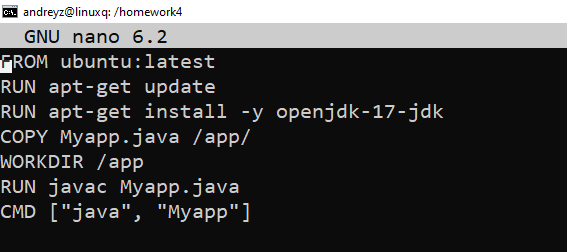
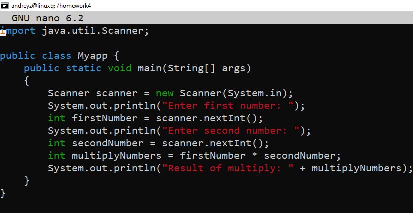
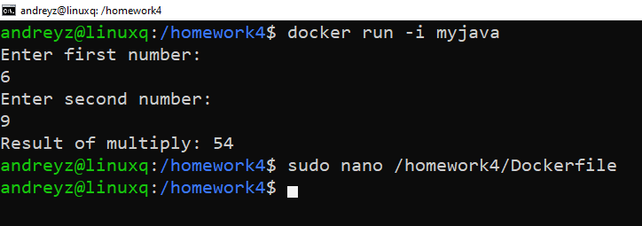

# Урок 4. Dockerfile и слои
1. Создадим директорию, где будем создавать Dockerfile

    ``sudo mkdir /homework4``
2. Создадим Dockerfile и зайдем в него

    ``sudo nano /homework4/Dockerfile``
3. Редактируем Dockerfile

4. Код который помещен в контенер.

5. Собираем контейнер

    ``docker build -t myjava .``
6. Запускаем контейнер

    ``docker run -i myjava``

