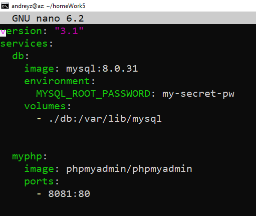
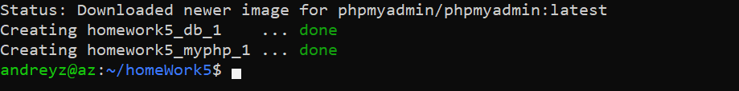
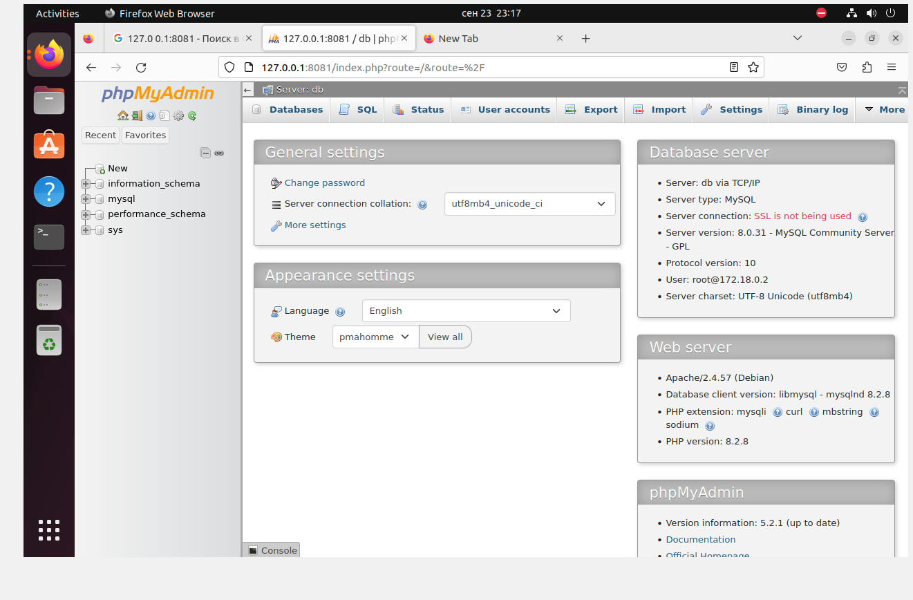

# Урок 5. Docker Compose и Docker Swarm
1. Создаем директорию и файл с расширением .yml

    ```mkdir homeWork5```

    ```nano docker-compose.yml```

2. Описываем файл "docker-compose.yml"

3. Собираем.

4. Открываем в браузере и переходим в контенеры.
